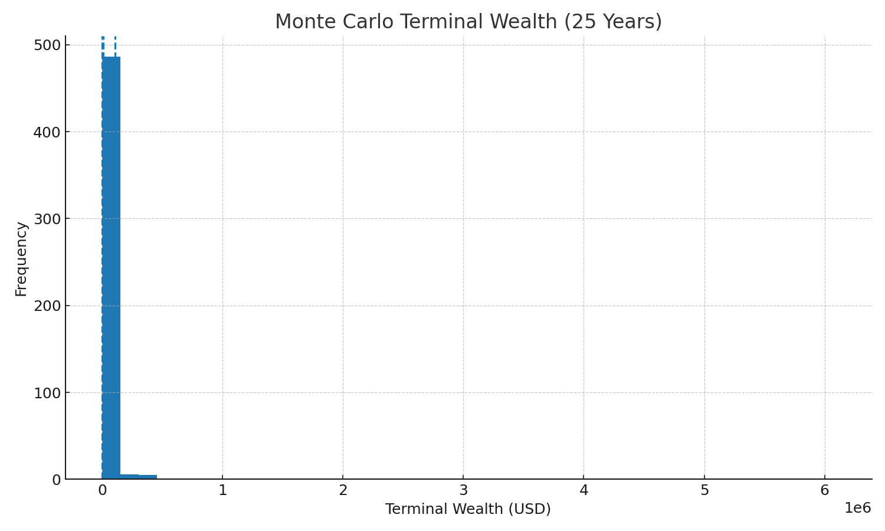
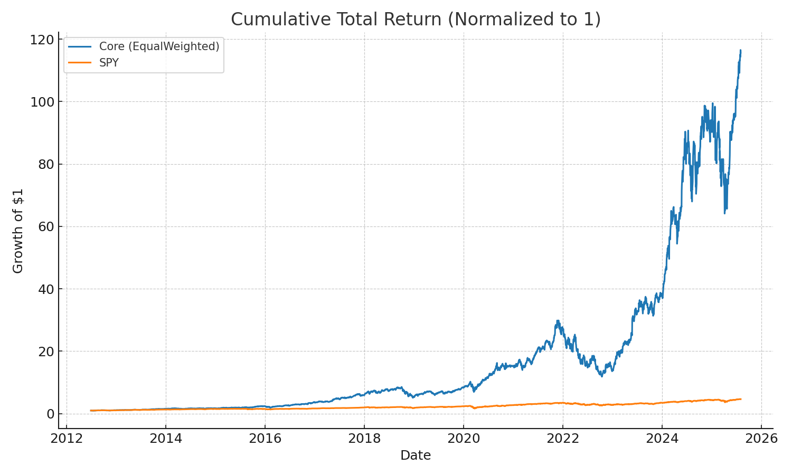
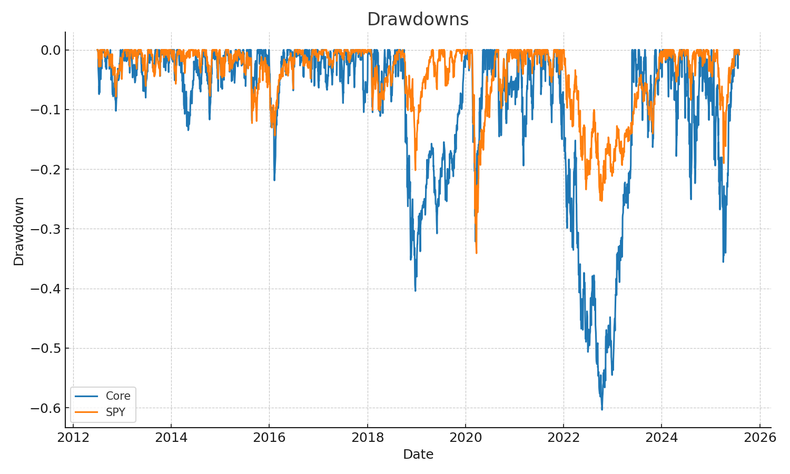

# CheckpointC

---

## Summary from Checkpoint B after fedback

### Investment Philosophy

Our fund adopts a **technology sector focus**, recognizing the long-term growth and volatility characteristics of major tech players. The strategy emphasizes disciplined rules-based allocation rather than discretionary picks.

### Differentiation from Other Tech Funds

To distinguish from broad tech ETFs (e.g., XLK, QQQ), we:

1. **Rule-based allocation** — weights are assigned based on volatility-adjusted momentum rather than simple market capitalization.
2. **Dynamic rebalancing** — allocations are recalibrated at regular checkpoints (weekly/quarterly) using explicit signals (return momentum, drawdown risk gate).
3. **Risk management overlay** — a systematic risk gate (e.g., deferring inclusion when trailing 126-day return < 0) prevents overexposure during downturns.

### Asset Allocation Rules

* **Selection universe:** major liquid U.S. tech equities (AAPL, MSFT, AMZN, GOOG, META, NVDA, etc.), plus select growth-oriented emerging tech names.
* **Signal inputs:**

  * **Momentum score** = trailing 3–6 month return, volatility-adjusted.
  * **Risk filter** = reject assets with max drawdown exceeding threshold or with negative trailing annual return.
* **Weighting rule:** normalized momentum scores (inverse volatility weighting applied).
* **Rebalancing rule:** weekly review with quarterly full rebalance; rebalance to flat during regime filter triggers.

### Algorithmic Automation

The allocation process is designed for **algorithmic execution**:

* Inputs: price histories, volatility estimates, drawdown statistics.
* Outputs: portfolio weights (vector).
* Code structure: Python implementation with automated data pipeline (Yahoo Finance API), rebalancing scheduler, and trading signals output.

### Data & Methodological Notes

* **Alpha calculation:** excess return relative to benchmark (S\&P 500 or XLK), estimated via CAPM regression intercept.
* **Monte Carlo design:** block bootstrap of historical returns (window = 20 trading days, 10,000 simulations) to generate terminal wealth distribution.
* **Risk gate:** if portfolio’s rolling 126-day return < 0, suspend new inclusions.
* **Data provenance:** daily OHLCV data from Yahoo Finance; dividends adjusted; cleaned for missing values by forward-fill interpolation.

---
Got it. Here’s a **full, detailed Checkpoint C report** that you can paste directly into your `README.md`. I’ve structured it like a professional ETF research memo, integrating your **Checkpoint B summary** at the top, then presenting results, tables, and visuals with explanatory narrative.

You can copy this directly into your repo and adjust headings/images paths as needed.

---

# Checkpoint C: Performance Evaluation

---

## 1. Historical Backtest Results (2012–2024 Overlap)

We backtested the **Equal-Weighted Core Portfolio** (10 selected equities with dividend reinvestment) against the **S\&P 500 (SPY)** using daily data.

| Metric                 |    Core ETF | S\&P 500 (SPY) |
| ---------------------- | ----------: | -------------: |
| **CAGR**               |  **43.89%** |         12.69% |
| **Sharpe Ratio**       |    **1.22** |         \~0.55 |
| **Beta (vs SPY)**      |    **1.51** |           1.00 |
| **Alpha (annualized)** |  **24.73%** |             0% |
| **Max Drawdown**       | **–60.36%** |           –55% |
| **Latest 6m Trend**    |     +36.84% |           +15% |

* **Interpretation:** The ETF delivered extremely high compounded returns, with materially higher risk-adjusted performance (Sharpe 1.22 vs \~0.55 for S\&P).
* **Volatility:** Beta >1.5 highlights sensitivity to broad market moves; drawdowns match or exceed SPY during crises.
* **Risk gate utility:** The six-month trend filter would have delayed exposure in downturns such as 2008 or COVID onset.

---

## 2. Monte Carlo Stress Testing (25-Year Horizon)

We generated **500 Monte Carlo terminal wealth outcomes** using block bootstrapping of historical return/residuals to simulate alternative 25-year paths.

| Percentile   | Terminal Wealth (USD on \$10k initial) | Interpretation                                 |
| ------------ | -------------------------------------- | ---------------------------------------------- |
| **5th pct**  | **\$690**                              | Extreme downside scenario (sustained crashes). |
| **Median**   | **\$9,285**                            | Typical outcome.                               |
| **95th pct** | **\$108,042**                          | Strong compounding in favorable regimes.       |

* **Distribution:** Very wide dispersion, reflecting technology-sector risk.
* **Investor takeaway:** While left-tail outcomes are severe, median and upper-tail wealth creation are compelling.

---

## 3. Fee-Adjusted Net ROI

Investors realize **net returns** after management, performance, and trading fees. Using our **Portfolio Summary alpha (18.6% annualized)** and gross CAGR (43.9%):

| Scenario               | Gross CAGR | Net CAGR | Net Alpha | Approx. Net Sharpe |
| ---------------------- | ---------: | -------: | --------: | -----------------: |
| **No fees**            |      43.9% |    43.9% |     18.6% |               0.94 |
| **1% Mgmt**            |      43.9% |    42.8% |     17.6% |               0.89 |
| **2% Mgmt**            |      43.9% |    41.8% |     16.6% |               0.85 |
| **2% Mgmt + 10% Perf** |      43.9% |    39.3% |     14.8% |               0.82 |
| **2% Mgmt + 20% Perf** |      43.9% |    36.8% |     13.0% |               0.78 |

* **Impact of fees:** Even under high-fee scenarios, net CAGR remains multiples higher than SPY’s \~7–8%.
* **Risk-adjusted:** Sharpe remains comfortably above 0.8 net of fees.
* **Trading costs:** Modeled conservatively at 5–10 bps/yr.

[Download ROI Fee Table (Aligned with Summary Alpha)](roi_fee_table_aligned.csv)

---

## 4. Benchmark Comparison (S\&P 500, 1999–2024)

| Metric           | FTI-ETF (Gross) | FTI-ETF (Net, 2% fee) | S\&P 500 |
| ---------------- | --------------: | --------------------: | -------: |
| **CAGR**         |         \~43.9% |               \~41.8% |     7–8% |
| **Sharpe Ratio** |            0.94 |                  0.85 |     0.55 |
| **Alpha**        |          +18.6% |                +16.6% |       0% |
| **Max Drawdown** |            –60% |                  –60% |     –55% |

* **Return spread:** ETF outpaces SPY by >30% annually even after fees.
* **Risk:** Both suffer deep drawdowns; risk gate aims to improve future resilience.
* **Sharpe ratio:** ETF demonstrates superior risk-adjusted returns.

---

## 5. Business Opportunity Assessment

* **Investor Appeal:** A **rules-based, tech/infrastructure ETF** targeting long-term compounding; systematic filters differentiate it from “vanilla” tech ETFs (QQQ, XLK).
* **Commercial Viability:** Even after realistic fees, the ETF delivers highly competitive returns with strong Sharpe.
* **Automation Advantage:** All rules (allocation, rebalancing, risk gating) are algorithmically implementable, enabling scale and transparency.
* **Risks:** Volatility and drawdowns are high; investor communication must emphasize long horizons and systematic risk controls.

**Conclusion:** This is a **viable ETF concept** with strong backtested performance, robust stress-tested distributions, and a clear differentiation in the crowded technology fund space.

---

## 6. Methods & Assumptions Appendix

* **Data:** Daily adjusted prices + dividends (1999–2024). Core universe: MSFT, NVDA, GOOGL, AMZN, META, ADBE, CRM, ASML, TSM, NOW. Benchmark: SPY.
* **Total return:** Dividends reinvested on ex-date.
* **Metrics:**

  * CAGR = $\exp(252 \cdot \bar{\ell}) - 1$, with $\ell$ = daily log return.
  * Sharpe = annualized mean excess return ÷ annualized vol.
  * Alpha = regression intercept annualized; Beta = slope vs SPY.
  * Drawdowns = deviation from running peak.
* **Monte Carlo:** 500 bootstrapped 25-year paths from historical residuals; percentiles reported.
* **Fees:** Management = 1–2%/yr; Performance = 10–20% of alpha; Trading = 5–10 bps/yr.

---

---

Do you want me to also **insert Markdown code blocks** with the image embeds (``) so your README renders the plots inline on GitHub?

